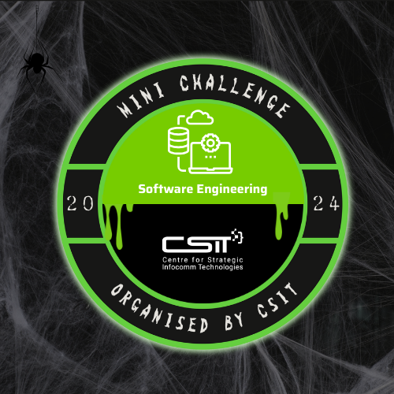

# CSIT SE Mini Challenge 2024
This project is my submission of CSIT SE Challenge 2024. This project build with Python 3.12.



## Project overview
This project have 2 program to be build. After done develop, it need to deploy into docker hub.

### Program 1: Data sensitizer
We need to retrieve data from CSIT server, but the data set are broken. It cause some of the data not valid anymore, we need to filter out those invalid data.

There are 3 criterial to be indicate as valid data:
- Name only contain alphabet and space
- Rating between 1.00 to 10.00
- Distance between 10.00 to 1000.00

### Program 2: Top 10 restaurants
After filter out invalid data, we need to calculate the score of each restaurant and select the top 10 restaurants.

The challenge in program 2 is finding an algorithm of best sorting performance.

# Step to run the program
If you running this after 6-Nov-2024, Program 1 might not able to communicate with the data set server, because it closed after the challenge.

But I had prepared a validated dataset for you to run program 2.

## Step 1 (Optional)
```
cd program_2

# Create a python virtual environment
python -m venv myenv
source myenv/bin/activate
```
## Step 2 (optional)
This step is optional for program 2, the `requests` dependency is for data validation with CIST server.
```
# Install dependency
pip install -r requirements.txt
```
## Step 3
```
# Run the program
./main.py
```

# References
https://docs.python.org/3/library/heapq.html#heapq.nlargest
https://stackoverflow.com/questions/30284693/pythonic-way-to-store-top-10-results
https://www.geeksforgeeks.org/heap-queue-or-heapq-in-python/
https://pynative.com/make-python-class-json-serializable/
https://stackoverflow.com/questions/8875706/heapq-with-custom-compare-predicate
